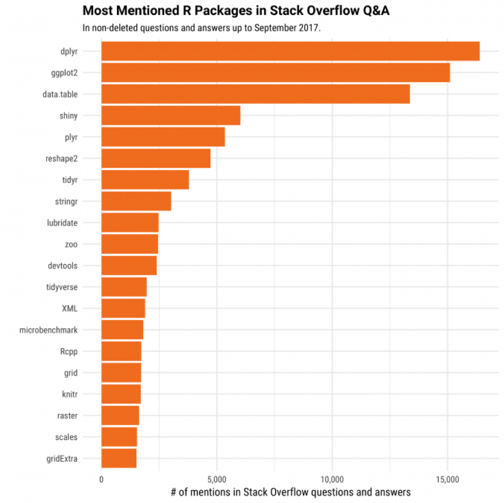
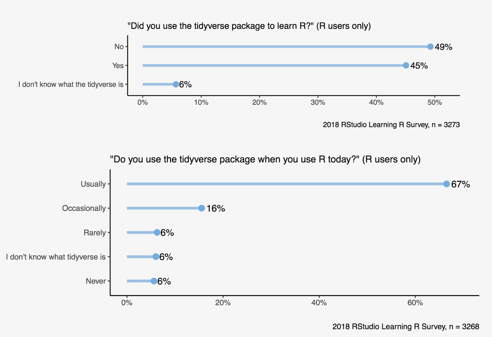
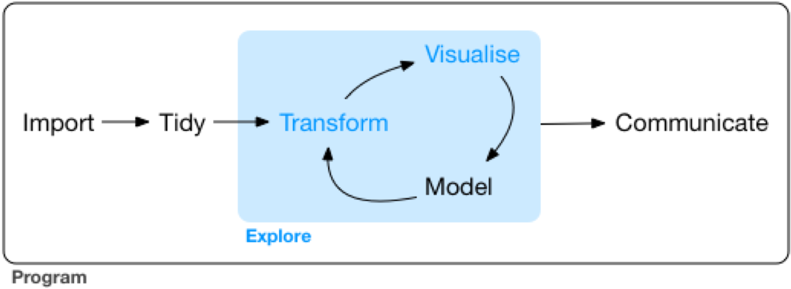
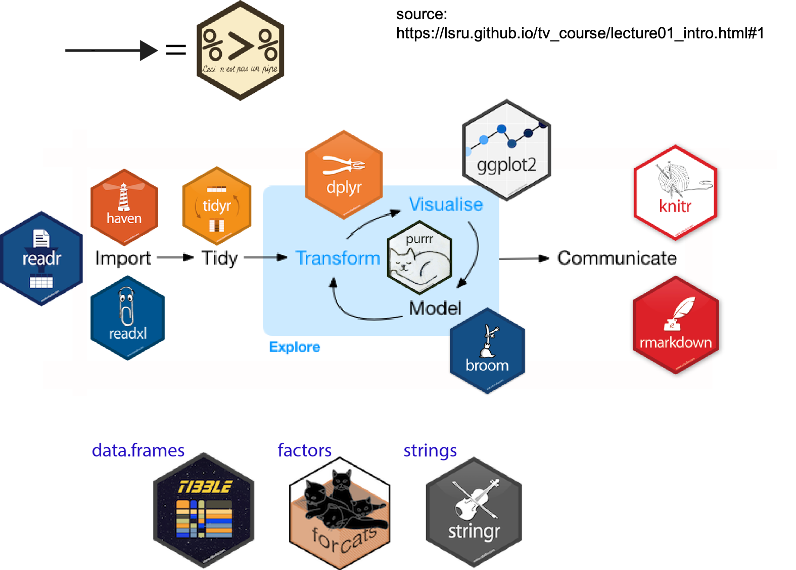
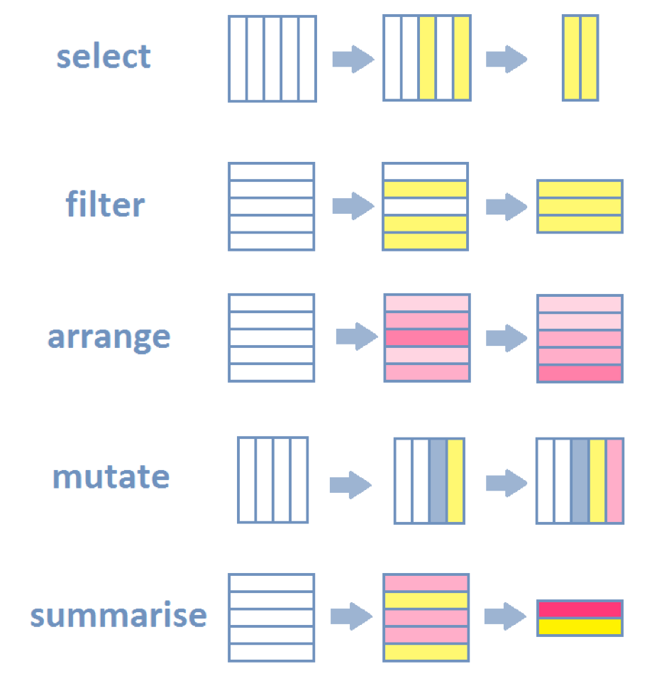
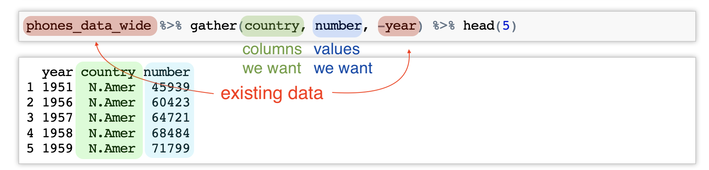
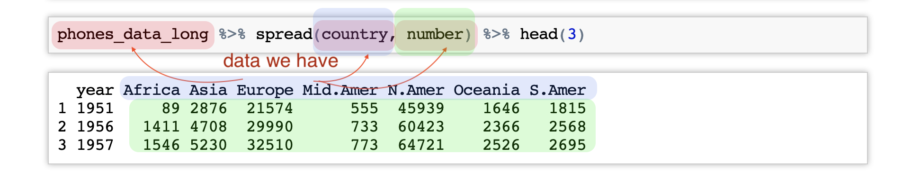
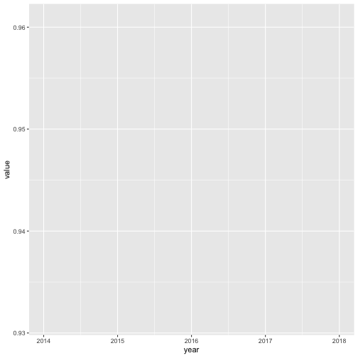
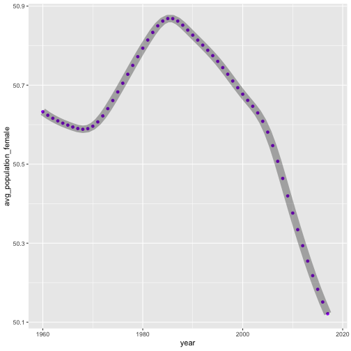

Introduction to tidyverse
========================================================
author: Anastasia Kuprina & Hazel Kavili
date: 09/06/2019
autosize: true

<style>

.tiny-text p {
  font-size: 5px; /*does not fucking work*/
}
.reveal .slides{
    height: 95% !important;  /* or other width */
}
.reveal h1, .reveal h2, .reveal h3 {
  word-wrap: normal;
  -moz-hyphens: none;
}
.reveal p, .reveal li, .reveal ul {
  font-size: 0.9em;
}
.small-code pre code {
  font-size: 0.9em;
}
</style>

Who are we?
========================================================


- Has been doing data analysis since late 2016
- Knows SQL, R and Python. Studying more Python & stats
- Tries to improve diversity and inclusivity of tech by organising regular codebar workshops and other events

***


- Studied Statistics (BSc and MSc) in Istanbul
- Worked on word-puzzle games in Wixot for 1.5 years 
- Founder of R-Ladies Istanbul
- Data Analyst in Seriously since November 2018


Why tidyverse?
========================================================
<br/>
- A huge community supported by RStudio themselves
- Help and support in social media
- tidytuesday

***
<div class = 'img-block' align="center">

</div>

Some interesting tidyverse learning & usage data
========================================================
<div class = 'img-block' align="center">

</div>

Data analysis workflow
========================================================
<div class = 'img-block' align="center">

</div>


Data analysis workflow: tidyverse version
========================================================
<div class = 'img-block' align="center">

</div>


Data analysis workflow in our daily work
========================================================
<div class = 'img-block' align="center">

</div>

Let's get to it!
========================================================

**Step 1**: Start up a new project in RStudio (File -> New project and follow the instructions)

**Step 2**: Make sure to install packages:


```r
install.packages('tidyverse', 'lubridate')
```
Note: if the package installer asks you whether or not to install with compilcation, respond 'n' for 'no'.

**Step 3**: Create a new script (File -> New script)

**Step 4**: Load libraries into the session & fetch the data:


```r
library(tidyverse)
library(lubridate)
library(reshape2)

df <- readr::read_csv('https://raw.githubusercontent.com/kuprinaga/R-ladies-workshop/master/nordic_data.csv')
```


Reading data in
========================================================


```r
readr::read_csv('example.csv')
readr::read_tsv('example.tsv')
readr::read_table('example.txt')
```
<br/>
Why use readr?
- progress bar
- faster for large files
- outputs exactly what the column types are 
- can automatically parse data types
- outputs a tibble (tidy dataframe)


Kind of a side note
========================================================
### Why tibble?
- printing (shows only the first 10 rows, and all the columns that fit on screen + datatype)
- Tibbles are strict about subsetting: <br/>
-> [] always returns another tibble, <br/>
-> [[]] always returns a vector
- Tibbles do not return partial names
- Strings are strings, not factors


Let's learn more about the data
========================================================
class: small-code

```r
summary(df)
```

```
      year      Country_Name       Country_Code      
 Min.   :1960   Length:236         Length:236        
 1st Qu.:1974   Class :character   Class :character  
 Median :1989   Mode  :character   Mode  :character  
 Mean   :1989                                        
 3rd Qu.:2004                                        
 Max.   :2018                                        
                                                     
 Adolescent_fertility_rate_births_per_1_000_women_ages_15_19_
 Min.   : 4.123                                              
 1st Qu.: 8.036                                              
 Median :12.164                                              
 Mean   :17.308                                              
 3rd Qu.:26.617                                              
 Max.   :45.913                                              
 NA's   :4                                                   
 Age_dependency_ratio_of_working_age_population_
 Min.   :46.85                                  
 1st Qu.:50.69                                  
 Median :54.05                                  
 Mean   :53.56                                  
 3rd Qu.:56.02                                  
 Max.   :60.60                                  
 NA's   :4                                      
 Age_population_age_0_female_interpolated
 Min.   :22803                           
 1st Qu.:28794                           
 Median :31913                           
 Mean   :36079                           
 3rd Qu.:40590                           
 Max.   :60289                           
 NA's   :4                               
 Age_population_age_0_male_interpolated
 Min.   :24234                         
 1st Qu.:30260                         
 Median :33476                         
 Mean   :37934                         
 3rd Qu.:42520                         
 Max.   :63430                         
 NA's   :4                             
 Age_population_age_01_female_interpolated
 Min.   :23102                            
 1st Qu.:29277                            
 Median :31780                            
 Mean   :36182                            
 3rd Qu.:40718                            
 Max.   :59392                            
 NA's   :4                                
 Age_population_age_01_male_interpolated
 Min.   :24492                          
 1st Qu.:30742                          
 Median :33418                          
 Mean   :38038                          
 3rd Qu.:42674                          
 Max.   :62511                          
 NA's   :4                              
 Age_population_age_02_female_interpolated
 Min.   :23382                            
 1st Qu.:29532                            
 Median :31764                            
 Mean   :36298                            
 3rd Qu.:40545                            
 Max.   :59071                            
 NA's   :4                                
 Age_population_age_02_male_interpolated
 Min.   :24732                          
 1st Qu.:31027                          
 Median :33329                          
 Mean   :38154                          
 3rd Qu.:42391                          
 Max.   :62168                          
 NA's   :4                              
 Age_population_age_03_female_interpolated
 Min.   :23653                            
 1st Qu.:29556                            
 Median :31875                            
 Mean   :36442                            
 3rd Qu.:40156                            
 Max.   :58930                            
 NA's   :4                                
 Age_population_age_03_male_interpolated
 Min.   :24963                          
 1st Qu.:31150                          
 Median :33482                          
 Mean   :38305                          
 3rd Qu.:41956                          
 Max.   :62012                          
 NA's   :4                              
 Age_population_age_04_female_interpolated
 Min.   :23899                            
 1st Qu.:29674                            
 Median :32045                            
 Mean   :36559                            
 3rd Qu.:40056                            
 Max.   :58998                            
 NA's   :4                                
 Age_population_age_04_male_interpolated
 Min.   :25153                          
 1st Qu.:31270                          
 Median :33696                          
 Mean   :38425                          
 3rd Qu.:41927                          
 Max.   :62097                          
 NA's   :4                              
 Age_population_age_05_female_interpolated
 Min.   :24085                            
 1st Qu.:29895                            
 Median :32161                            
 Mean   :36662                            
 3rd Qu.:41143                            
 Max.   :59061                            
 NA's   :4                                
 Age_population_age_05_male_interpolated
 Min.   :25338                          
 1st Qu.:31434                          
 Median :33805                          
 Mean   :38527                          
 3rd Qu.:42903                          
 Max.   :62122                          
 NA's   :4                              
 Birth_rate_crude_per_1_000_people_ Death_rate_crude_per_1_000_people_
 Min.   : 9.10                      Min.   : 7.700                    
 1st Qu.:11.50                      1st Qu.: 9.500                    
 Median :12.60                      Median : 9.900                    
 Mean   :13.04                      Mean   : 9.993                    
 3rd Qu.:14.00                      3rd Qu.:10.500                    
 Max.   :18.50                      Max.   :12.100                    
 NA's   :4                          NA's   :4                         
 Fertility_rate_total_births_per_woman_ GDP_current_US_    
 Min.   :1.380                          Min.   :5.163e+09  
 1st Qu.:1.710                          1st Qu.:3.400e+10  
 Median :1.810                          Median :1.194e+11  
 Mean   :1.904                          Mean   :1.574e+11  
 3rd Qu.:1.942                          3rd Qu.:2.531e+11  
 Max.   :2.980                          Max.   :5.794e+11  
 NA's   :4                              NA's   :4          
 GDP_per_capita_Current_US_ Inflation_consumer_prices_annual_
 Min.   :  1179             Min.   :-0.4945                  
 1st Qu.:  6764             1st Qu.: 1.9253                  
 Median : 22422             Median : 3.4165                  
 Mean   : 26283             Mean   : 4.5857                  
 3rd Qu.: 38654             3rd Qu.: 6.9353                  
 Max.   :103059             Max.   :17.8114                  
 NA's   :4                  NA's   :4                        
 Life_expectancy_at_birth_female_years_
 Min.   :72.24                         
 1st Qu.:77.35                         
 Median :79.20                         
 Mean   :79.25                         
 3rd Qu.:81.65                         
 Max.   :84.40                         
 NA's   :4                             
 Life_expectancy_at_birth_male_years_ Population_ages_0_14_female
 Min.   :65.09                        Min.   :391307             
 1st Qu.:71.23                        1st Qu.:449800             
 Median :72.78                        Median :475984             
 Mean   :73.52                        Mean   :554806             
 3rd Qu.:76.22                        3rd Qu.:678134             
 Max.   :80.90                        Max.   :858311             
 NA's   :4                            NA's   :4                  
 Population_ages_0_14_of_total_ Population_ages_15_64_female
 Min.   :16.37                  Min.   :1127457             
 1st Qu.:17.96                  1st Qu.:1532222             
 Median :19.28                  Median :1677554             
 Mean   :20.13                  Mean   :1857320             
 3rd Qu.:21.74                  3rd Qu.:1981936             
 Max.   :30.41                  Max.   :3086964             
 NA's   :4                      NA's   :4                   
 Population_ages_15_64_male Population_ages_15_64_of_total_
 Min.   :1129967            Min.   :62.27                  
 1st Qu.:1501511            1st Qu.:64.09                  
 Median :1723196            Median :64.91                  
 Mean   :1891386            Mean   :65.15                  
 3rd Qu.:2009612            3rd Qu.:66.36                  
 Max.   :3197079            Max.   :68.10                  
 NA's   :4                  NA's   :4                      
 Population_ages_15_64_total Population_ages_65_and_above_female
 Min.   :2257422             Min.   : 203691                    
 1st Qu.:3038145             1st Qu.: 369027                    
 Median :3403464             Median : 456222                    
 Mean   :3748712             Mean   : 500324                    
 3rd Qu.:3991547             3rd Qu.: 575268                    
 Max.   :6284045             Max.   :1079139                    
 NA's   :4                   NA's   :4                          
 Population_ages_65_and_above_of_total_ Population_female
 Min.   : 7.328                         Min.   :1797400  
 1st Qu.:12.886                         1st Qu.:2368052  
 Median :15.007                         Median :2596508  
 Mean   :14.713                         Mean   :2912450  
 3rd Qu.:16.360                         3rd Qu.:3111078  
 Max.   :21.228                         Max.   :5024414  
 NA's   :4                              NA's   :4        
 Population_female_of_total_ Population_total   GDP_growth_annual_
 Min.   :49.55               Min.   : 3581239   Min.   :-8.269    
 1st Qu.:50.33               1st Qu.: 4623662   1st Qu.: 1.507    
 Median :50.52               Median : 5122300   Median : 2.756    
 Mean   :50.63               Mean   : 5757404   Mean   : 2.734    
 3rd Qu.:50.72               3rd Qu.: 6194899   3rd Qu.: 4.162    
 Max.   :51.83               Max.   :10057698   Max.   : 9.593    
 NA's   :4                   NA's   :4          NA's   :8         
```

========================================================
class: small-code

```r
head(df, 10)
```

```
# A tibble: 10 x 37
    year Country_Name Country_Code Adolescent_fert… Age_dependency_…
   <int> <chr>        <chr>                   <dbl>            <dbl>
 1  1960 Denmark      DNK                      44.2             55.8
 2  1961 Denmark      DNK                      45.0             55.6
 3  1962 Denmark      DNK                      45.9             55.2
 4  1963 Denmark      DNK                      45.5             54.8
 5  1964 Denmark      DNK                      45.1             54.5
 6  1965 Denmark      DNK                      44.7             54.3
 7  1966 Denmark      DNK                      44.4             54.4
 8  1967 Denmark      DNK                      44.0             54.6
 9  1968 Denmark      DNK                      40.7             54.8
10  1969 Denmark      DNK                      37.4             55.0
# ... with 32 more variables:
#   Age_population_age_0_female_interpolated <int>,
#   Age_population_age_0_male_interpolated <int>,
#   Age_population_age_01_female_interpolated <int>,
#   Age_population_age_01_male_interpolated <int>,
#   Age_population_age_02_female_interpolated <int>,
#   Age_population_age_02_male_interpolated <int>,
#   Age_population_age_03_female_interpolated <int>,
#   Age_population_age_03_male_interpolated <int>,
#   Age_population_age_04_female_interpolated <int>,
#   Age_population_age_04_male_interpolated <int>,
#   Age_population_age_05_female_interpolated <int>,
#   Age_population_age_05_male_interpolated <int>,
#   Birth_rate_crude_per_1_000_people_ <dbl>,
#   Death_rate_crude_per_1_000_people_ <dbl>,
#   Fertility_rate_total_births_per_woman_ <dbl>, GDP_current_US_ <dbl>,
#   GDP_per_capita_Current_US_ <dbl>,
#   Inflation_consumer_prices_annual_ <dbl>,
#   Life_expectancy_at_birth_female_years_ <dbl>,
#   Life_expectancy_at_birth_male_years_ <dbl>,
#   Population_ages_0_14_female <int>,
#   Population_ages_0_14_of_total_ <dbl>,
#   Population_ages_15_64_female <int>, Population_ages_15_64_male <int>,
#   Population_ages_15_64_of_total_ <dbl>,
#   Population_ages_15_64_total <int>,
#   Population_ages_65_and_above_female <int>,
#   Population_ages_65_and_above_of_total_ <dbl>, Population_female <int>,
#   Population_female_of_total_ <dbl>, Population_total <int>,
#   GDP_growth_annual_ <dbl>
```

========================================================
class: small-code

```r
str(df)
```

```
Classes 'tbl_df', 'tbl' and 'data.frame':	236 obs. of  37 variables:
 $ year                                                        : int  1960 1961 1962 1963 1964 1965 1966 1967 1968 1969 ...
 $ Country_Name                                                : chr  "Denmark" "Denmark" "Denmark" "Denmark" ...
 $ Country_Code                                                : chr  "DNK" "DNK" "DNK" "DNK" ...
 $ Adolescent_fertility_rate_births_per_1_000_women_ages_15_19_: num  44.2 45 45.9 45.5 45.1 ...
 $ Age_dependency_ratio_of_working_age_population_             : num  55.8 55.6 55.2 54.8 54.5 ...
 $ Age_population_age_0_female_interpolated                    : int  38797 39700 40226 40386 40240 39855 39189 38256 37205 36243 ...
 $ Age_population_age_0_male_interpolated                      : int  40519 41292 41731 41866 41780 41547 41132 40547 39843 39095 ...
 $ Age_population_age_01_female_interpolated                   : int  36505 38292 37831 38443 38877 39066 39680 38594 38056 37479 ...
 $ Age_population_age_01_male_interpolated                     : int  38452 40044 39555 40095 40520 40779 41395 40681 40382 39968 ...
 $ Age_population_age_02_female_interpolated                   : int  35003 36372 37831 36967 37758 38325 39014 39519 38555 38307 ...
 $ Age_population_age_02_male_interpolated                     : int  37117 38315 39612 38763 39496 40071 40735 41261 40646 40512 ...
 $ Age_population_age_03_female_interpolated                   : int  34189 35103 36280 37392 36868 37641 38350 38975 39359 38776 ...
 $ Age_population_age_03_male_interpolated                     : int  36418 37192 38219 39205 38693 39431 40094 40708 41128 40770 ...
 $ Age_population_age_04_female_interpolated                   : int  33961 34406 35242 36209 36949 37026 37706 38387 38937 39194 ...
 $ Age_population_age_04_male_interpolated                     : int  36259 36599 37306 38147 38799 38867 39488 40134 40682 40983 ...
 $ Age_population_age_05_female_interpolated                   : int  34218 34203 34663 35403 36135 36491 37100 37782 38427 38895 ...
 $ Age_population_age_05_male_interpolated                     : int  36545 36461 36818 37444 38078 38388 38932 39563 40176 40645 ...
 $ Birth_rate_crude_per_1_000_people_                          : num  16.6 16.6 16.7 17.6 17.7 18 18.4 16.8 15.3 14.6 ...
 $ Death_rate_crude_per_1_000_people_                          : num  9.5 9.4 9.8 9.8 9.9 10.1 10.3 9.9 9.7 9.8 ...
 $ Fertility_rate_total_births_per_woman_                      : num  2.57 2.55 2.55 2.67 2.6 2.61 2.62 2.35 2.12 2 ...
 $ GDP_current_US_                                             : num  6.25e+09 6.93e+09 7.81e+09 8.32e+09 9.51e+09 ...
 $ GDP_per_capita_Current_US_                                  : num  1365 1504 1681 1775 2013 ...
 $ Inflation_consumer_prices_annual_                           : num  1.26 3.45 7.38 6.11 3.09 ...
 $ Life_expectancy_at_birth_female_years_                      : num  74 74.4 74.4 74.5 74.8 ...
 $ Life_expectancy_at_birth_male_years_                        : num  70.4 70.6 70.3 70.4 70.3 ...
 $ Population_ages_0_14_female                                 : int  561643 560269 557581 554298 552010 551172 552603 554141 555159 556276 ...
 $ Population_ages_0_14_of_total_                              : num  25.2 25 24.7 24.3 24 ...
 $ Population_ages_15_64_female                                : int  1484063 1495246 1509267 1523949 1537736 1549424 1558277 1566467 1571307 1575034 ...
 $ Population_ages_15_64_male                                  : int  1455561 1468735 1484952 1502241 1519265 1534888 1548269 1561535 1571727 1580747 ...
 $ Population_ages_15_64_of_total_                             : num  64.2 64.3 64.4 64.6 64.7 ...
 $ Population_ages_15_64_total                                 : int  2939628 2963981 2994219 3026185 3056997 3084306 3106547 3127998 3143027 3155777 ...
 $ Population_ages_65_and_above_female                         : int  261702 268492 275846 283448 291111 298708 307135 315546 323486 331441 ...
 $ Population_ages_65_and_above_of_total_                      : num  10.6 10.8 10.9 11.1 11.2 ...
 $ Population_female                                           : int  2307409 2324007 2342694 2361695 2380857 2399304 2418014 2436154 2449952 2462751 ...
 $ Population_female_of_total_                                 : num  50.4 50.4 50.4 50.4 50.4 ...
 $ Population_total                                            : int  4579603 4611687 4647727 4684483 4722072 4759012 4797381 4835354 4864883 4891860 ...
 $ GDP_growth_annual_                                          : num  NA 6.379 5.667 0.637 9.27 ...
 - attr(*, "spec")=List of 2
  ..$ cols   :List of 37
  .. ..$ year                                                        : list()
  .. .. ..- attr(*, "class")= chr  "collector_integer" "collector"
  .. ..$ Country_Name                                                : list()
  .. .. ..- attr(*, "class")= chr  "collector_character" "collector"
  .. ..$ Country_Code                                                : list()
  .. .. ..- attr(*, "class")= chr  "collector_character" "collector"
  .. ..$ Adolescent_fertility_rate_births_per_1_000_women_ages_15_19_: list()
  .. .. ..- attr(*, "class")= chr  "collector_double" "collector"
  .. ..$ Age_dependency_ratio_of_working_age_population_             : list()
  .. .. ..- attr(*, "class")= chr  "collector_double" "collector"
  .. ..$ Age_population_age_0_female_interpolated                    : list()
  .. .. ..- attr(*, "class")= chr  "collector_integer" "collector"
  .. ..$ Age_population_age_0_male_interpolated                      : list()
  .. .. ..- attr(*, "class")= chr  "collector_integer" "collector"
  .. ..$ Age_population_age_01_female_interpolated                   : list()
  .. .. ..- attr(*, "class")= chr  "collector_integer" "collector"
  .. ..$ Age_population_age_01_male_interpolated                     : list()
  .. .. ..- attr(*, "class")= chr  "collector_integer" "collector"
  .. ..$ Age_population_age_02_female_interpolated                   : list()
  .. .. ..- attr(*, "class")= chr  "collector_integer" "collector"
  .. ..$ Age_population_age_02_male_interpolated                     : list()
  .. .. ..- attr(*, "class")= chr  "collector_integer" "collector"
  .. ..$ Age_population_age_03_female_interpolated                   : list()
  .. .. ..- attr(*, "class")= chr  "collector_integer" "collector"
  .. ..$ Age_population_age_03_male_interpolated                     : list()
  .. .. ..- attr(*, "class")= chr  "collector_integer" "collector"
  .. ..$ Age_population_age_04_female_interpolated                   : list()
  .. .. ..- attr(*, "class")= chr  "collector_integer" "collector"
  .. ..$ Age_population_age_04_male_interpolated                     : list()
  .. .. ..- attr(*, "class")= chr  "collector_integer" "collector"
  .. ..$ Age_population_age_05_female_interpolated                   : list()
  .. .. ..- attr(*, "class")= chr  "collector_integer" "collector"
  .. ..$ Age_population_age_05_male_interpolated                     : list()
  .. .. ..- attr(*, "class")= chr  "collector_integer" "collector"
  .. ..$ Birth_rate_crude_per_1_000_people_                          : list()
  .. .. ..- attr(*, "class")= chr  "collector_double" "collector"
  .. ..$ Death_rate_crude_per_1_000_people_                          : list()
  .. .. ..- attr(*, "class")= chr  "collector_double" "collector"
  .. ..$ Fertility_rate_total_births_per_woman_                      : list()
  .. .. ..- attr(*, "class")= chr  "collector_double" "collector"
  .. ..$ GDP_current_US_                                             : list()
  .. .. ..- attr(*, "class")= chr  "collector_double" "collector"
  .. ..$ GDP_per_capita_Current_US_                                  : list()
  .. .. ..- attr(*, "class")= chr  "collector_double" "collector"
  .. ..$ Inflation_consumer_prices_annual_                           : list()
  .. .. ..- attr(*, "class")= chr  "collector_double" "collector"
  .. ..$ Life_expectancy_at_birth_female_years_                      : list()
  .. .. ..- attr(*, "class")= chr  "collector_double" "collector"
  .. ..$ Life_expectancy_at_birth_male_years_                        : list()
  .. .. ..- attr(*, "class")= chr  "collector_double" "collector"
  .. ..$ Population_ages_0_14_female                                 : list()
  .. .. ..- attr(*, "class")= chr  "collector_integer" "collector"
  .. ..$ Population_ages_0_14_of_total_                              : list()
  .. .. ..- attr(*, "class")= chr  "collector_double" "collector"
  .. ..$ Population_ages_15_64_female                                : list()
  .. .. ..- attr(*, "class")= chr  "collector_integer" "collector"
  .. ..$ Population_ages_15_64_male                                  : list()
  .. .. ..- attr(*, "class")= chr  "collector_integer" "collector"
  .. ..$ Population_ages_15_64_of_total_                             : list()
  .. .. ..- attr(*, "class")= chr  "collector_double" "collector"
  .. ..$ Population_ages_15_64_total                                 : list()
  .. .. ..- attr(*, "class")= chr  "collector_integer" "collector"
  .. ..$ Population_ages_65_and_above_female                         : list()
  .. .. ..- attr(*, "class")= chr  "collector_integer" "collector"
  .. ..$ Population_ages_65_and_above_of_total_                      : list()
  .. .. ..- attr(*, "class")= chr  "collector_double" "collector"
  .. ..$ Population_female                                           : list()
  .. .. ..- attr(*, "class")= chr  "collector_integer" "collector"
  .. ..$ Population_female_of_total_                                 : list()
  .. .. ..- attr(*, "class")= chr  "collector_double" "collector"
  .. ..$ Population_total                                            : list()
  .. .. ..- attr(*, "class")= chr  "collector_integer" "collector"
  .. ..$ GDP_growth_annual_                                          : list()
  .. .. ..- attr(*, "class")= chr  "collector_double" "collector"
  ..$ default: list()
  .. ..- attr(*, "class")= chr  "collector_guess" "collector"
  ..- attr(*, "class")= chr "col_spec"
```


Let's learn more about the data: tidyverse way
========================================================
class: small-code

```r
glimpse(df)
```

```
Observations: 236
Variables: 37
$ year                                                         <int> 1...
$ Country_Name                                                 <chr> "...
$ Country_Code                                                 <chr> "...
$ Adolescent_fertility_rate_births_per_1_000_women_ages_15_19_ <dbl> 4...
$ Age_dependency_ratio_of_working_age_population_              <dbl> 5...
$ Age_population_age_0_female_interpolated                     <int> 3...
$ Age_population_age_0_male_interpolated                       <int> 4...
$ Age_population_age_01_female_interpolated                    <int> 3...
$ Age_population_age_01_male_interpolated                      <int> 3...
$ Age_population_age_02_female_interpolated                    <int> 3...
$ Age_population_age_02_male_interpolated                      <int> 3...
$ Age_population_age_03_female_interpolated                    <int> 3...
$ Age_population_age_03_male_interpolated                      <int> 3...
$ Age_population_age_04_female_interpolated                    <int> 3...
$ Age_population_age_04_male_interpolated                      <int> 3...
$ Age_population_age_05_female_interpolated                    <int> 3...
$ Age_population_age_05_male_interpolated                      <int> 3...
$ Birth_rate_crude_per_1_000_people_                           <dbl> 1...
$ Death_rate_crude_per_1_000_people_                           <dbl> 9...
$ Fertility_rate_total_births_per_woman_                       <dbl> 2...
$ GDP_current_US_                                              <dbl> 6...
$ GDP_per_capita_Current_US_                                   <dbl> 1...
$ Inflation_consumer_prices_annual_                            <dbl> 1...
$ Life_expectancy_at_birth_female_years_                       <dbl> 7...
$ Life_expectancy_at_birth_male_years_                         <dbl> 7...
$ Population_ages_0_14_female                                  <int> 5...
$ Population_ages_0_14_of_total_                               <dbl> 2...
$ Population_ages_15_64_female                                 <int> 1...
$ Population_ages_15_64_male                                   <int> 1...
$ Population_ages_15_64_of_total_                              <dbl> 6...
$ Population_ages_15_64_total                                  <int> 2...
$ Population_ages_65_and_above_female                          <int> 2...
$ Population_ages_65_and_above_of_total_                       <dbl> 1...
$ Population_female                                            <int> 2...
$ Population_female_of_total_                                  <dbl> 5...
$ Population_total                                             <int> 4...
$ GDP_growth_annual_                                           <dbl> N...
```


How to manipulate tidy-style
========================================================
<div class = 'img-block' align="center">

</div>


Compare to the Base R way: select
========================================================

```r
df[ , c('year', 'Country_Code')]

df %>% 
  select(year, Country_Code)
```


Compare to the Base R way: summarise by group
========================================================
class:small-code

```r
head(aggregate(df$Population_female_of_total_,
          by = list(df$year),
          FUN = mean),
     3)

tapply(df$Population_female_of_total_, df$year, FUN=mean)

df %>% 
  group_by(year) %>% 
  summarise(avg_pop = mean(Population_female_of_total_)) %>%
  head(3)
```

Why use pipes?
========================================================
Here are two pieces of code that return exactly the same thing. What do you think about their readability?


```r
# piped way
df %>%
  group_by(Country_Name) %>%
  summarise(Life_expectancy = max(Life_expectancy_at_birth_female_years_)) %>%
  arrange(Life_expectancy)
```


```r
# same functions, no pipes
arrange(summarise(group_by(df, Country_Name), Life_expectancy = max(Life_expectancy_at_birth_female_years_),Life_expectancy))
```

<div class = 'img-block' align="right">

</div>


Let's get to it!
========================================================
class: small-code
### Step 0 - let's look at the data again
#### Our question: what is the maximum life expectancy for women across all years?


```r
df %>%
  glimpse()
```

```
Observations: 236
Variables: 37
$ year                                                         <int> 1...
$ Country_Name                                                 <chr> "...
$ Country_Code                                                 <chr> "...
$ Adolescent_fertility_rate_births_per_1_000_women_ages_15_19_ <dbl> 4...
$ Age_dependency_ratio_of_working_age_population_              <dbl> 5...
$ Age_population_age_0_female_interpolated                     <int> 3...
$ Age_population_age_0_male_interpolated                       <int> 4...
$ Age_population_age_01_female_interpolated                    <int> 3...
$ Age_population_age_01_male_interpolated                      <int> 3...
$ Age_population_age_02_female_interpolated                    <int> 3...
$ Age_population_age_02_male_interpolated                      <int> 3...
$ Age_population_age_03_female_interpolated                    <int> 3...
$ Age_population_age_03_male_interpolated                      <int> 3...
$ Age_population_age_04_female_interpolated                    <int> 3...
$ Age_population_age_04_male_interpolated                      <int> 3...
$ Age_population_age_05_female_interpolated                    <int> 3...
$ Age_population_age_05_male_interpolated                      <int> 3...
$ Birth_rate_crude_per_1_000_people_                           <dbl> 1...
$ Death_rate_crude_per_1_000_people_                           <dbl> 9...
$ Fertility_rate_total_births_per_woman_                       <dbl> 2...
$ GDP_current_US_                                              <dbl> 6...
$ GDP_per_capita_Current_US_                                   <dbl> 1...
$ Inflation_consumer_prices_annual_                            <dbl> 1...
$ Life_expectancy_at_birth_female_years_                       <dbl> 7...
$ Life_expectancy_at_birth_male_years_                         <dbl> 7...
$ Population_ages_0_14_female                                  <int> 5...
$ Population_ages_0_14_of_total_                               <dbl> 2...
$ Population_ages_15_64_female                                 <int> 1...
$ Population_ages_15_64_male                                   <int> 1...
$ Population_ages_15_64_of_total_                              <dbl> 6...
$ Population_ages_15_64_total                                  <int> 2...
$ Population_ages_65_and_above_female                          <int> 2...
$ Population_ages_65_and_above_of_total_                       <dbl> 1...
$ Population_female                                            <int> 2...
$ Population_female_of_total_                                  <dbl> 5...
$ Population_total                                             <int> 4...
$ GDP_growth_annual_                                           <dbl> N...
```

Exercise 1, step 1
========================================================


```r
df %>%
  group_by(Country_Name)
```

```
# A tibble: 236 x 37
# Groups:   Country_Name [4]
    year Country_Name Country_Code Adolescent_fert… Age_dependency_…
   <int> <chr>        <chr>                   <dbl>            <dbl>
 1  1960 Denmark      DNK                      44.2             55.8
 2  1961 Denmark      DNK                      45.0             55.6
 3  1962 Denmark      DNK                      45.9             55.2
 4  1963 Denmark      DNK                      45.5             54.8
 5  1964 Denmark      DNK                      45.1             54.5
 6  1965 Denmark      DNK                      44.7             54.3
 7  1966 Denmark      DNK                      44.4             54.4
 8  1967 Denmark      DNK                      44.0             54.6
 9  1968 Denmark      DNK                      40.7             54.8
10  1969 Denmark      DNK                      37.4             55.0
# ... with 226 more rows, and 32 more variables:
#   Age_population_age_0_female_interpolated <int>,
#   Age_population_age_0_male_interpolated <int>,
#   Age_population_age_01_female_interpolated <int>,
#   Age_population_age_01_male_interpolated <int>,
#   Age_population_age_02_female_interpolated <int>,
#   Age_population_age_02_male_interpolated <int>,
#   Age_population_age_03_female_interpolated <int>,
#   Age_population_age_03_male_interpolated <int>,
#   Age_population_age_04_female_interpolated <int>,
#   Age_population_age_04_male_interpolated <int>,
#   Age_population_age_05_female_interpolated <int>,
#   Age_population_age_05_male_interpolated <int>,
#   Birth_rate_crude_per_1_000_people_ <dbl>,
#   Death_rate_crude_per_1_000_people_ <dbl>,
#   Fertility_rate_total_births_per_woman_ <dbl>, GDP_current_US_ <dbl>,
#   GDP_per_capita_Current_US_ <dbl>,
#   Inflation_consumer_prices_annual_ <dbl>,
#   Life_expectancy_at_birth_female_years_ <dbl>,
#   Life_expectancy_at_birth_male_years_ <dbl>,
#   Population_ages_0_14_female <int>,
#   Population_ages_0_14_of_total_ <dbl>,
#   Population_ages_15_64_female <int>, Population_ages_15_64_male <int>,
#   Population_ages_15_64_of_total_ <dbl>,
#   Population_ages_15_64_total <int>,
#   Population_ages_65_and_above_female <int>,
#   Population_ages_65_and_above_of_total_ <dbl>, Population_female <int>,
#   Population_female_of_total_ <dbl>, Population_total <int>,
#   GDP_growth_annual_ <dbl>
```

Exercise 1, step 2
========================================================


```r
df %>%
  group_by(Country_Name) %>%
  summarise(Life_expectancy = max(Life_expectancy_at_birth_female_years_, na.rm = TRUE))
```

```
# A tibble: 4 x 2
  Country_Name Life_expectancy
  <chr>                  <dbl>
1 Denmark                 82.9
2 Finland                 84.4
3 Norway                  84.2
4 Sweden                  84.2
```


Exercise 1, step 3 + assignment
========================================================

```r
df_example_1 <- df %>%
  group_by(Country_Name) %>%
  summarise(Life_expectancy = max(Life_expectancy_at_birth_female_years_, na.rm = TRUE)) %>%
  arrange(desc(Life_expectancy))
```


Exercise 2, step 0
========================================================
class: small-code
### Let's look at the data
#### Our new question is: what is the average female population over time?

```r
df %>%
  head()
```

```
# A tibble: 6 x 37
   year Country_Name Country_Code Adolescent_fert… Age_dependency_…
  <int> <chr>        <chr>                   <dbl>            <dbl>
1  1960 Denmark      DNK                      44.2             55.8
2  1961 Denmark      DNK                      45.0             55.6
3  1962 Denmark      DNK                      45.9             55.2
4  1963 Denmark      DNK                      45.5             54.8
5  1964 Denmark      DNK                      45.1             54.5
6  1965 Denmark      DNK                      44.7             54.3
# ... with 32 more variables:
#   Age_population_age_0_female_interpolated <int>,
#   Age_population_age_0_male_interpolated <int>,
#   Age_population_age_01_female_interpolated <int>,
#   Age_population_age_01_male_interpolated <int>,
#   Age_population_age_02_female_interpolated <int>,
#   Age_population_age_02_male_interpolated <int>,
#   Age_population_age_03_female_interpolated <int>,
#   Age_population_age_03_male_interpolated <int>,
#   Age_population_age_04_female_interpolated <int>,
#   Age_population_age_04_male_interpolated <int>,
#   Age_population_age_05_female_interpolated <int>,
#   Age_population_age_05_male_interpolated <int>,
#   Birth_rate_crude_per_1_000_people_ <dbl>,
#   Death_rate_crude_per_1_000_people_ <dbl>,
#   Fertility_rate_total_births_per_woman_ <dbl>, GDP_current_US_ <dbl>,
#   GDP_per_capita_Current_US_ <dbl>,
#   Inflation_consumer_prices_annual_ <dbl>,
#   Life_expectancy_at_birth_female_years_ <dbl>,
#   Life_expectancy_at_birth_male_years_ <dbl>,
#   Population_ages_0_14_female <int>,
#   Population_ages_0_14_of_total_ <dbl>,
#   Population_ages_15_64_female <int>, Population_ages_15_64_male <int>,
#   Population_ages_15_64_of_total_ <dbl>,
#   Population_ages_15_64_total <int>,
#   Population_ages_65_and_above_female <int>,
#   Population_ages_65_and_above_of_total_ <dbl>, Population_female <int>,
#   Population_female_of_total_ <dbl>, Population_total <int>,
#   GDP_growth_annual_ <dbl>
```

Exercise 2, step 1
========================================================


```r
df %>%
  group_by(year)
```

```
# A tibble: 236 x 37
# Groups:   year [59]
    year Country_Name Country_Code Adolescent_fert… Age_dependency_…
   <int> <chr>        <chr>                   <dbl>            <dbl>
 1  1960 Denmark      DNK                      44.2             55.8
 2  1961 Denmark      DNK                      45.0             55.6
 3  1962 Denmark      DNK                      45.9             55.2
 4  1963 Denmark      DNK                      45.5             54.8
 5  1964 Denmark      DNK                      45.1             54.5
 6  1965 Denmark      DNK                      44.7             54.3
 7  1966 Denmark      DNK                      44.4             54.4
 8  1967 Denmark      DNK                      44.0             54.6
 9  1968 Denmark      DNK                      40.7             54.8
10  1969 Denmark      DNK                      37.4             55.0
# ... with 226 more rows, and 32 more variables:
#   Age_population_age_0_female_interpolated <int>,
#   Age_population_age_0_male_interpolated <int>,
#   Age_population_age_01_female_interpolated <int>,
#   Age_population_age_01_male_interpolated <int>,
#   Age_population_age_02_female_interpolated <int>,
#   Age_population_age_02_male_interpolated <int>,
#   Age_population_age_03_female_interpolated <int>,
#   Age_population_age_03_male_interpolated <int>,
#   Age_population_age_04_female_interpolated <int>,
#   Age_population_age_04_male_interpolated <int>,
#   Age_population_age_05_female_interpolated <int>,
#   Age_population_age_05_male_interpolated <int>,
#   Birth_rate_crude_per_1_000_people_ <dbl>,
#   Death_rate_crude_per_1_000_people_ <dbl>,
#   Fertility_rate_total_births_per_woman_ <dbl>, GDP_current_US_ <dbl>,
#   GDP_per_capita_Current_US_ <dbl>,
#   Inflation_consumer_prices_annual_ <dbl>,
#   Life_expectancy_at_birth_female_years_ <dbl>,
#   Life_expectancy_at_birth_male_years_ <dbl>,
#   Population_ages_0_14_female <int>,
#   Population_ages_0_14_of_total_ <dbl>,
#   Population_ages_15_64_female <int>, Population_ages_15_64_male <int>,
#   Population_ages_15_64_of_total_ <dbl>,
#   Population_ages_15_64_total <int>,
#   Population_ages_65_and_above_female <int>,
#   Population_ages_65_and_above_of_total_ <dbl>, Population_female <int>,
#   Population_female_of_total_ <dbl>, Population_total <int>,
#   GDP_growth_annual_ <dbl>
```

Exercise 2, step 2
========================================================


```r
df %>%
  group_by(year) %>%
  summarise(avg_population_female = mean(Population_female_of_total_))
```

```
# A tibble: 59 x 2
    year avg_population_female
   <int>                 <dbl>
 1  1960                  50.6
 2  1961                  50.6
 3  1962                  50.6
 4  1963                  50.6
 5  1964                  50.6
 6  1965                  50.6
 7  1966                  50.6
 8  1967                  50.6
 9  1968                  50.6
10  1969                  50.6
# ... with 49 more rows
```

Exercise 2, step 3 + assignment
========================================================


```r
df_example_2 <- df %>%
  group_by(year) %>%
  summarise(avg_population_female = mean(Population_female_of_total_)) %>%
  arrange(desc(year))
```


A bit more theory: tidy data concept
========================================================

<div class = 'img-block' align="center">


</div>


spread() & gather()
========================================================
class: small-code
### tidyverse (tidyr) way


```r
phones_data_wide %>%
  head(3)
```

```
  N.Amer Europe Asia S.Amer Oceania Africa Mid.Amer year
1  45939  21574 2876   1815    1646     89      555 1951
2  60423  29990 4708   2568    2366   1411      733 1956
3  64721  32510 5230   2695    2526   1546      773 1957
```

```r
phones_data_wide %>% gather(country, number, -year) %>% head(5)
```

```
  year country number
1 1951  N.Amer  45939
2 1956  N.Amer  60423
3 1957  N.Amer  64721
4 1958  N.Amer  68484
5 1959  N.Amer  71799
```

```r
phones_data_long %>% spread(country, number) %>% head(3)
```

```
  year Africa Asia Europe Mid.Amer N.Amer Oceania S.Amer
1 1951     89 2876  21574      555  45939    1646   1815
2 1956   1411 4708  29990      733  60423    2366   2568
3 1957   1546 5230  32510      773  64721    2526   2695
```


A bit more explanation
========================================================
### gather()
<div class = 'img-block' align="center">

</div>
### spread()
<div class = 'img-block' align="center">

</div>


Exercise 3, step 0
========================================================
class: small-code
### Let's look at the data
#### What has fertility rate been like in the past 5 years in each country?


```r
df %>%
  head()
```

```
# A tibble: 6 x 37
   year Country_Name Country_Code Adolescent_fert… Age_dependency_…
  <int> <chr>        <chr>                   <dbl>            <dbl>
1  1960 Denmark      DNK                      44.2             55.8
2  1961 Denmark      DNK                      45.0             55.6
3  1962 Denmark      DNK                      45.9             55.2
4  1963 Denmark      DNK                      45.5             54.8
5  1964 Denmark      DNK                      45.1             54.5
6  1965 Denmark      DNK                      44.7             54.3
# ... with 32 more variables:
#   Age_population_age_0_female_interpolated <int>,
#   Age_population_age_0_male_interpolated <int>,
#   Age_population_age_01_female_interpolated <int>,
#   Age_population_age_01_male_interpolated <int>,
#   Age_population_age_02_female_interpolated <int>,
#   Age_population_age_02_male_interpolated <int>,
#   Age_population_age_03_female_interpolated <int>,
#   Age_population_age_03_male_interpolated <int>,
#   Age_population_age_04_female_interpolated <int>,
#   Age_population_age_04_male_interpolated <int>,
#   Age_population_age_05_female_interpolated <int>,
#   Age_population_age_05_male_interpolated <int>,
#   Birth_rate_crude_per_1_000_people_ <dbl>,
#   Death_rate_crude_per_1_000_people_ <dbl>,
#   Fertility_rate_total_births_per_woman_ <dbl>, GDP_current_US_ <dbl>,
#   GDP_per_capita_Current_US_ <dbl>,
#   Inflation_consumer_prices_annual_ <dbl>,
#   Life_expectancy_at_birth_female_years_ <dbl>,
#   Life_expectancy_at_birth_male_years_ <dbl>,
#   Population_ages_0_14_female <int>,
#   Population_ages_0_14_of_total_ <dbl>,
#   Population_ages_15_64_female <int>, Population_ages_15_64_male <int>,
#   Population_ages_15_64_of_total_ <dbl>,
#   Population_ages_15_64_total <int>,
#   Population_ages_65_and_above_female <int>,
#   Population_ages_65_and_above_of_total_ <dbl>, Population_female <int>,
#   Population_female_of_total_ <dbl>, Population_total <int>,
#   GDP_growth_annual_ <dbl>
```


Exercise 3, step 1
========================================================
class: small-code

```r
df %>% 
  top_n(20, year)
```

```
# A tibble: 20 x 37
    year Country_Name Country_Code Adolescent_fert… Age_dependency_…
   <int> <chr>        <chr>                   <dbl>            <dbl>
 1  2014 Denmark      DNK                      4.31             55.3
 2  2015 Denmark      DNK                      4.25             56.0
 3  2016 Denmark      DNK                      4.19             56.3
 4  2017 Denmark      DNK                      4.12             56.6
 5  2018 Denmark      DNK                     NA                NA  
 6  2014 Finland      FIN                      7.16             56.4
 7  2015 Finland      FIN                      7.03             57.9
 8  2016 Finland      FIN                      6.90             59.1
 9  2017 Finland      FIN                      6.77             60.3
10  2018 Finland      FIN                     NA                NA  
11  2014 Norway       NOR                      5.86             51.8
12  2015 Norway       NOR                      5.77             52.1
13  2016 Norway       NOR                      5.68             52.5
14  2017 Norway       NOR                      5.59             52.9
15  2018 Norway       NOR                     NA                NA  
16  2014 Sweden       SWE                      5.34             57.4
17  2015 Sweden       SWE                      5.31             58.5
18  2016 Sweden       SWE                      5.27             59.3
19  2017 Sweden       SWE                      5.24             60.1
20  2018 Sweden       SWE                     NA                NA  
# ... with 32 more variables:
#   Age_population_age_0_female_interpolated <int>,
#   Age_population_age_0_male_interpolated <int>,
#   Age_population_age_01_female_interpolated <int>,
#   Age_population_age_01_male_interpolated <int>,
#   Age_population_age_02_female_interpolated <int>,
#   Age_population_age_02_male_interpolated <int>,
#   Age_population_age_03_female_interpolated <int>,
#   Age_population_age_03_male_interpolated <int>,
#   Age_population_age_04_female_interpolated <int>,
#   Age_population_age_04_male_interpolated <int>,
#   Age_population_age_05_female_interpolated <int>,
#   Age_population_age_05_male_interpolated <int>,
#   Birth_rate_crude_per_1_000_people_ <dbl>,
#   Death_rate_crude_per_1_000_people_ <dbl>,
#   Fertility_rate_total_births_per_woman_ <dbl>, GDP_current_US_ <dbl>,
#   GDP_per_capita_Current_US_ <dbl>,
#   Inflation_consumer_prices_annual_ <dbl>,
#   Life_expectancy_at_birth_female_years_ <dbl>,
#   Life_expectancy_at_birth_male_years_ <dbl>,
#   Population_ages_0_14_female <int>,
#   Population_ages_0_14_of_total_ <dbl>,
#   Population_ages_15_64_female <int>, Population_ages_15_64_male <int>,
#   Population_ages_15_64_of_total_ <dbl>,
#   Population_ages_15_64_total <int>,
#   Population_ages_65_and_above_female <int>,
#   Population_ages_65_and_above_of_total_ <dbl>, Population_female <int>,
#   Population_female_of_total_ <dbl>, Population_total <int>,
#   GDP_growth_annual_ <dbl>
```
#### Why?


Side note: top_n()
========================================================
class: small-code
incremental: true

```r
df %>% 
  top_n(20, year) %>% 
  pull(year)
```

```
 [1] 2014 2015 2016 2017 2018 2014 2015 2016 2017 2018 2014 2015 2016 2017
[15] 2018 2014 2015 2016 2017 2018
```
#### Things to note:
- top_n() returning multiple values of year - why?
- pull() versus select()


```r
df %>% arrange(year) %>%
  top_n(20,year) %>%
  select(year, Country_Code)
```

```
# A tibble: 20 x 2
    year Country_Code
   <int> <chr>       
 1  2014 DNK         
 2  2014 FIN         
 3  2014 NOR         
 4  2014 SWE         
 5  2015 DNK         
 6  2015 FIN         
 7  2015 NOR         
 8  2015 SWE         
 9  2016 DNK         
10  2016 FIN         
11  2016 NOR         
12  2016 SWE         
13  2017 DNK         
14  2017 FIN         
15  2017 NOR         
16  2017 SWE         
17  2018 DNK         
18  2018 FIN         
19  2018 NOR         
20  2018 SWE         
```


Continuation: top_n()
========================================================
class: small-code

```r
df %>% arrange(year) %>%
  top_n(20,year) %>%
  select(year, Country_Code) %>% head(5)
```

```
# A tibble: 5 x 2
   year Country_Code
  <int> <chr>       
1  2014 DNK         
2  2014 FIN         
3  2014 NOR         
4  2014 SWE         
5  2015 DNK         
```


```r
df %>% 
  select(Country_Name, Fertility_rate_total_births_per_woman_, year) %>%
  spread(Country_Name, Fertility_rate_total_births_per_woman_) %>%
  top_n(5, year)
```

```
# A tibble: 5 x 5
   year Denmark Finland Norway Sweden
  <int>   <dbl>   <dbl>  <dbl>  <dbl>
1  2014    1.69    1.71   1.75   1.88
2  2015    1.71    1.65   1.72   1.85
3  2016    1.79    1.57   1.71   1.85
4  2017    1.79    1.57   1.71   1.85
5  2018   NA      NA     NA     NA   
```


Exercise 3, step 1
========================================================

```r
df %>% 
  top_n(20, year) %>% 
  group_by(Country_Name, year)
```

```
# A tibble: 20 x 37
# Groups:   Country_Name, year [20]
    year Country_Name Country_Code Adolescent_fert… Age_dependency_…
   <int> <chr>        <chr>                   <dbl>            <dbl>
 1  2014 Denmark      DNK                      4.31             55.3
 2  2015 Denmark      DNK                      4.25             56.0
 3  2016 Denmark      DNK                      4.19             56.3
 4  2017 Denmark      DNK                      4.12             56.6
 5  2018 Denmark      DNK                     NA                NA  
 6  2014 Finland      FIN                      7.16             56.4
 7  2015 Finland      FIN                      7.03             57.9
 8  2016 Finland      FIN                      6.90             59.1
 9  2017 Finland      FIN                      6.77             60.3
10  2018 Finland      FIN                     NA                NA  
11  2014 Norway       NOR                      5.86             51.8
12  2015 Norway       NOR                      5.77             52.1
13  2016 Norway       NOR                      5.68             52.5
14  2017 Norway       NOR                      5.59             52.9
15  2018 Norway       NOR                     NA                NA  
16  2014 Sweden       SWE                      5.34             57.4
17  2015 Sweden       SWE                      5.31             58.5
18  2016 Sweden       SWE                      5.27             59.3
19  2017 Sweden       SWE                      5.24             60.1
20  2018 Sweden       SWE                     NA                NA  
# ... with 32 more variables:
#   Age_population_age_0_female_interpolated <int>,
#   Age_population_age_0_male_interpolated <int>,
#   Age_population_age_01_female_interpolated <int>,
#   Age_population_age_01_male_interpolated <int>,
#   Age_population_age_02_female_interpolated <int>,
#   Age_population_age_02_male_interpolated <int>,
#   Age_population_age_03_female_interpolated <int>,
#   Age_population_age_03_male_interpolated <int>,
#   Age_population_age_04_female_interpolated <int>,
#   Age_population_age_04_male_interpolated <int>,
#   Age_population_age_05_female_interpolated <int>,
#   Age_population_age_05_male_interpolated <int>,
#   Birth_rate_crude_per_1_000_people_ <dbl>,
#   Death_rate_crude_per_1_000_people_ <dbl>,
#   Fertility_rate_total_births_per_woman_ <dbl>, GDP_current_US_ <dbl>,
#   GDP_per_capita_Current_US_ <dbl>,
#   Inflation_consumer_prices_annual_ <dbl>,
#   Life_expectancy_at_birth_female_years_ <dbl>,
#   Life_expectancy_at_birth_male_years_ <dbl>,
#   Population_ages_0_14_female <int>,
#   Population_ages_0_14_of_total_ <dbl>,
#   Population_ages_15_64_female <int>, Population_ages_15_64_male <int>,
#   Population_ages_15_64_of_total_ <dbl>,
#   Population_ages_15_64_total <int>,
#   Population_ages_65_and_above_female <int>,
#   Population_ages_65_and_above_of_total_ <dbl>, Population_female <int>,
#   Population_female_of_total_ <dbl>, Population_total <int>,
#   GDP_growth_annual_ <dbl>
```


Exercise 3, step 2
========================================================
class:small-code

```r
 df %>% 
  top_n(20, year) %>% 
  group_by(Country_Name, year) %>%
  select(Fertility_rate_total_births_per_woman_) 
```

```
# A tibble: 20 x 3
# Groups:   Country_Name, year [20]
   Country_Name  year Fertility_rate_total_births_per_woman_
   <chr>        <int>                                  <dbl>
 1 Denmark       2014                                   1.69
 2 Denmark       2015                                   1.71
 3 Denmark       2016                                   1.79
 4 Denmark       2017                                   1.79
 5 Denmark       2018                                  NA   
 6 Finland       2014                                   1.71
 7 Finland       2015                                   1.65
 8 Finland       2016                                   1.57
 9 Finland       2017                                   1.57
10 Finland       2018                                  NA   
11 Norway        2014                                   1.75
12 Norway        2015                                   1.72
13 Norway        2016                                   1.71
14 Norway        2017                                   1.71
15 Norway        2018                                  NA   
16 Sweden        2014                                   1.88
17 Sweden        2015                                   1.85
18 Sweden        2016                                   1.85
19 Sweden        2017                                   1.85
20 Sweden        2018                                  NA   
```
Things to note:
- top_n() hacking
- selecting just one column still selects that column + groups


Exercise 3, step 3 + assignment
========================================================
class:small-code
incremental:true

#### Time to try out spread()
##### Before spread():

```r
## old data:
 df %>% 
  top_n(20, year) %>% 
  group_by(Country_Name, year) %>%
  select(Fertility_rate_total_births_per_woman_) %>% head(3)
```

```
# A tibble: 3 x 3
# Groups:   Country_Name, year [3]
  Country_Name  year Fertility_rate_total_births_per_woman_
  <chr>        <int>                                  <dbl>
1 Denmark       2014                                   1.69
2 Denmark       2015                                   1.71
3 Denmark       2016                                   1.79
```

##### After spread():

```r
## spread data:
df %>% 
  top_n(20, year) %>% 
  group_by(Country_Name, year) %>%
  select(Fertility_rate_total_births_per_woman_) %>%
  spread(Country_Name, Fertility_rate_total_births_per_woman_)
```

```
# A tibble: 5 x 5
# Groups:   year [5]
   year Denmark Finland Norway Sweden
  <int>   <dbl>   <dbl>  <dbl>  <dbl>
1  2014    1.69    1.71   1.75   1.88
2  2015    1.71    1.65   1.72   1.85
3  2016    1.79    1.57   1.71   1.85
4  2017    1.79    1.57   1.71   1.85
5  2018   NA      NA     NA     NA   
```


New verb: mutate()
========================================================
incremental:true

<div class = 'img-block' align="center" style = "z-index:0;position:absolute;top:100px;margin-left:auto;margin-right:auto;">

</div>


Compare to the Base R way: simple mutate (no groups)
========================================================
class:small-code

```r
df$ratio <- df$Life_expectancy_at_birth_male_years_ / df$Life_expectancy_at_birth_female_years_
head(df$ratio, 3)

df %>% 
  mutate(ratio = Life_expectancy_at_birth_male_years_ /
            Life_expectancy_at_birth_female_years_) %>%
  select(ratio) %>%
  head(3)
```


Exercise 4, step 0
========================================================
class:small-code
### Let's look at the data
#### What is male/female population share is like for the last available year?


```r
df %>% 
  filter(year == max(year)) 
```

```
# A tibble: 4 x 37
   year Country_Name Country_Code Adolescent_fert… Age_dependency_…
  <int> <chr>        <chr>                   <dbl>            <dbl>
1  2018 Denmark      DNK                        NA               NA
2  2018 Finland      FIN                        NA               NA
3  2018 Norway       NOR                        NA               NA
4  2018 Sweden       SWE                        NA               NA
# ... with 32 more variables:
#   Age_population_age_0_female_interpolated <int>,
#   Age_population_age_0_male_interpolated <int>,
#   Age_population_age_01_female_interpolated <int>,
#   Age_population_age_01_male_interpolated <int>,
#   Age_population_age_02_female_interpolated <int>,
#   Age_population_age_02_male_interpolated <int>,
#   Age_population_age_03_female_interpolated <int>,
#   Age_population_age_03_male_interpolated <int>,
#   Age_population_age_04_female_interpolated <int>,
#   Age_population_age_04_male_interpolated <int>,
#   Age_population_age_05_female_interpolated <int>,
#   Age_population_age_05_male_interpolated <int>,
#   Birth_rate_crude_per_1_000_people_ <dbl>,
#   Death_rate_crude_per_1_000_people_ <dbl>,
#   Fertility_rate_total_births_per_woman_ <dbl>, GDP_current_US_ <dbl>,
#   GDP_per_capita_Current_US_ <dbl>,
#   Inflation_consumer_prices_annual_ <dbl>,
#   Life_expectancy_at_birth_female_years_ <dbl>,
#   Life_expectancy_at_birth_male_years_ <dbl>,
#   Population_ages_0_14_female <int>,
#   Population_ages_0_14_of_total_ <dbl>,
#   Population_ages_15_64_female <int>, Population_ages_15_64_male <int>,
#   Population_ages_15_64_of_total_ <dbl>,
#   Population_ages_15_64_total <int>,
#   Population_ages_65_and_above_female <int>,
#   Population_ages_65_and_above_of_total_ <dbl>, Population_female <int>,
#   Population_female_of_total_ <dbl>, Population_total <int>,
#   GDP_growth_annual_ <dbl>
```

Exercise 4, step 1
========================================================
class:small-code


```r
df %>%
  select(year, Country_Name, Population_ages_15_64_female, Population_ages_15_64_total, Population_ages_15_64_male) %>%
  na.omit() 
```

```
# A tibble: 232 x 5
    year Country_Name Population_ages_… Population_ages_… Population_ages…
   <int> <chr>                    <int>             <int>            <int>
 1  1960 Denmark                1484063           2939628          1455561
 2  1961 Denmark                1495246           2963981          1468735
 3  1962 Denmark                1509267           2994219          1484952
 4  1963 Denmark                1523949           3026185          1502241
 5  1964 Denmark                1537736           3056997          1519265
 6  1965 Denmark                1549424           3084306          1534888
 7  1966 Denmark                1558277           3106547          1548269
 8  1967 Denmark                1566467           3127998          1561535
 9  1968 Denmark                1571307           3143027          1571727
10  1969 Denmark                1575034           3155777          1580747
# ... with 222 more rows
```


Exercise 4, step 2
========================================================
class:small-code


```r
df %>%
  select(year, Country_Name, Population_ages_15_64_female, Population_ages_15_64_total, Population_ages_15_64_male) %>%
  na.omit() %>%
  filter(year == max(year))
```

```
# A tibble: 4 x 5
   year Country_Name Population_ages_1… Population_ages_… Population_ages…
  <int> <chr>                     <int>             <int>            <int>
1  2017 Denmark                 1823679           3680222          1856545
2  2017 Finland                 1695010           3435196          1740171
3  2017 Norway                  1679050           3451390          1772340
4  2017 Sweden                  3086964           6284045          3197079
```


Exercise 4, step 3
========================================================
class:small-code


```r
df %>%
  select(year, Country_Name, Population_ages_15_64_female, Population_ages_15_64_total, Population_ages_15_64_male) %>%
  na.omit() %>%
  filter(year == max(year)) %>%
  mutate(population_female_from_all = Population_ages_15_64_female/Population_ages_15_64_total,
         population_male_from_all = Population_ages_15_64_male/Population_ages_15_64_total)
```

```
# A tibble: 4 x 7
   year Country_Name Population_ages… Population_ages… Population_ages…
  <int> <chr>                   <int>            <int>            <int>
1  2017 Denmark               1823679          3680222          1856545
2  2017 Finland               1695010          3435196          1740171
3  2017 Norway                1679050          3451390          1772340
4  2017 Sweden                3086964          6284045          3197079
# ... with 2 more variables: population_female_from_all <dbl>,
#   population_male_from_all <dbl>
```


Exercise 4, step 4 - assignment
========================================================
class:small-code


```r
df_example_4 <- df %>%
  select(year, Country_Name, Population_ages_15_64_female, Population_ages_15_64_total, Population_ages_15_64_male) %>%
  na.omit() %>%
  filter(year == max(year)) %>%
  mutate(population_female_from_all = Population_ages_15_64_female/Population_ages_15_64_total,
         population_male_from_all = Population_ages_15_64_male/Population_ages_15_64_total) 
```


Exercise 5, step 0
========================================================
class:small-code
### Let's look at the data
#### Not a super exciting question - just trying out more spread()
#### What was inflation like over time in each country? Each country should be its own column

```r
df %>%
  select(year, Country_Name, Inflation_consumer_prices_annual_)
```

```
# A tibble: 236 x 3
    year Country_Name Inflation_consumer_prices_annual_
   <int> <chr>                                    <dbl>
 1  1960 Denmark                                   1.26
 2  1961 Denmark                                   3.45
 3  1962 Denmark                                   7.38
 4  1963 Denmark                                   6.11
 5  1964 Denmark                                   3.09
 6  1965 Denmark                                   5.45
 7  1966 Denmark                                   7.06
 8  1967 Denmark                                   8.21
 9  1968 Denmark                                   8.01
10  1969 Denmark                                   3.49
# ... with 226 more rows
```

Exercise 5, step 1
========================================================
class:small-code
incremental:true
#### Before spread():

```r
df %>%
  select(year, Country_Name, Inflation_consumer_prices_annual_) %>% head(4)
```

```
# A tibble: 4 x 3
   year Country_Name Inflation_consumer_prices_annual_
  <int> <chr>                                    <dbl>
1  1960 Denmark                                   1.26
2  1961 Denmark                                   3.45
3  1962 Denmark                                   7.38
4  1963 Denmark                                   6.11
```

#### After spread():

```r
df %>%
  select(year, Country_Name, Inflation_consumer_prices_annual_) %>%
  spread(Country_Name, Inflation_consumer_prices_annual_) 
```

```
# A tibble: 59 x 5
    year Denmark Finland Norway Sweden
   <int>   <dbl>   <dbl>  <dbl>  <dbl>
 1  1960    1.26    3.42  0.360   4.14
 2  1961    3.45    1.69  2.16    2.16
 3  1962    7.38    4.38  5.27    4.77
 4  1963    6.11    5.00  2.47    2.87
 5  1964    3.09   10.3   5.87    3.39
 6  1965    5.45    4.94  4.19    5.01
 7  1966    7.06    3.87  3.25    6.40
 8  1967    8.21    5.38  4.58    4.29
 9  1968    8.01    9.19  3.45    1.94
10  1969    3.49    2.21  2.96    2.69
# ... with 49 more rows
```

```r
wide_df <- df %>%
  select(year, Country_Name, Inflation_consumer_prices_annual_) %>%
  spread(Country_Name, Inflation_consumer_prices_annual_) 
```

#### Let's gather it back!

Exercise 5, step 2
========================================================
class:small-code
incremental:true
#### Before gather():

```r
wide_df %>% head(3)
```

```
# A tibble: 3 x 5
   year Denmark Finland Norway Sweden
  <int>   <dbl>   <dbl>  <dbl>  <dbl>
1  1960    1.26    3.42  0.360   4.14
2  1961    3.45    1.69  2.16    2.16
3  1962    7.38    4.38  5.27    4.77
```

#### After spread():

```r
wide_df %>%
  gather(country, val, -year)
```

```
# A tibble: 236 x 3
    year country   val
   <int> <chr>   <dbl>
 1  1960 Denmark  1.26
 2  1961 Denmark  3.45
 3  1962 Denmark  7.38
 4  1963 Denmark  6.11
 5  1964 Denmark  3.09
 6  1965 Denmark  5.45
 7  1966 Denmark  7.06
 8  1967 Denmark  8.21
 9  1968 Denmark  8.01
10  1969 Denmark  3.49
# ... with 226 more rows
```


Exercise 6, step 0
========================================================
class:small-code
### Let's look at the data
#### What is births to deaths ratio per country?
#### Save country values in own columns

```r
df %>%
  select(Country_Name, year, Death_rate_crude_per_1_000_people_, Birth_rate_crude_per_1_000_people_)
```

```
# A tibble: 236 x 4
   Country_Name  year Death_rate_crude_per_1_00… Birth_rate_crude_per_1_0…
   <chr>        <int>                      <dbl>                     <dbl>
 1 Denmark       1960                        9.5                      16.6
 2 Denmark       1961                        9.4                      16.6
 3 Denmark       1962                        9.8                      16.7
 4 Denmark       1963                        9.8                      17.6
 5 Denmark       1964                        9.9                      17.7
 6 Denmark       1965                       10.1                      18  
 7 Denmark       1966                       10.3                      18.4
 8 Denmark       1967                        9.9                      16.8
 9 Denmark       1968                        9.7                      15.3
10 Denmark       1969                        9.8                      14.6
# ... with 226 more rows
```


Exercise 6, step 1
========================================================
class:small-code


```r
df %>%
  select(Country_Name, year, Death_rate_crude_per_1_000_people_, Birth_rate_crude_per_1_000_people_) %>%
  mutate(births_per_death = Birth_rate_crude_per_1_000_people_/Death_rate_crude_per_1_000_people_)
```

```
# A tibble: 236 x 5
   Country_Name  year Death_rate_crude… Birth_rate_crude… births_per_death
   <chr>        <int>             <dbl>             <dbl>            <dbl>
 1 Denmark       1960               9.5              16.6             1.75
 2 Denmark       1961               9.4              16.6             1.77
 3 Denmark       1962               9.8              16.7             1.70
 4 Denmark       1963               9.8              17.6             1.80
 5 Denmark       1964               9.9              17.7             1.79
 6 Denmark       1965              10.1              18               1.78
 7 Denmark       1966              10.3              18.4             1.79
 8 Denmark       1967               9.9              16.8             1.70
 9 Denmark       1968               9.7              15.3             1.58
10 Denmark       1969               9.8              14.6             1.49
# ... with 226 more rows
```


Exercise 6, step 2
========================================================
class:small-code
#### Next: spread!

```r
df %>%
  select(Country_Name, year, Death_rate_crude_per_1_000_people_, Birth_rate_crude_per_1_000_people_) %>%
  mutate(births_per_death = Birth_rate_crude_per_1_000_people_/Death_rate_crude_per_1_000_people_) %>%
  select(Country_Name, year, births_per_death)
```

```
# A tibble: 236 x 3
   Country_Name  year births_per_death
   <chr>        <int>            <dbl>
 1 Denmark       1960             1.75
 2 Denmark       1961             1.77
 3 Denmark       1962             1.70
 4 Denmark       1963             1.80
 5 Denmark       1964             1.79
 6 Denmark       1965             1.78
 7 Denmark       1966             1.79
 8 Denmark       1967             1.70
 9 Denmark       1968             1.58
10 Denmark       1969             1.49
# ... with 226 more rows
```


Exercise 6, step 3 - spread()
========================================================
class:small-code
incremental:true
#### Before spread():

```r
df %>%
  select(Country_Name, year, Death_rate_crude_per_1_000_people_, Birth_rate_crude_per_1_000_people_) %>%
  mutate(births_per_death = Birth_rate_crude_per_1_000_people_/Death_rate_crude_per_1_000_people_) %>%
  select(Country_Name, year, births_per_death) %>% head(3)
```

```
# A tibble: 3 x 3
  Country_Name  year births_per_death
  <chr>        <int>            <dbl>
1 Denmark       1960             1.75
2 Denmark       1961             1.77
3 Denmark       1962             1.70
```


#### After spread():

```r
df %>%
  select(Country_Name, year, Death_rate_crude_per_1_000_people_, Birth_rate_crude_per_1_000_people_) %>%
  mutate(births_per_death = Birth_rate_crude_per_1_000_people_/Death_rate_crude_per_1_000_people_) %>%
  select(Country_Name, year, births_per_death) %>%
  spread(Country_Name, births_per_death)
```

```
# A tibble: 59 x 5
    year Denmark Finland Norway Sweden
   <int>   <dbl>   <dbl>  <dbl>  <dbl>
 1  1960    1.75    2.06   1.90   1.37
 2  1961    1.77    2.02   1.88   1.42
 3  1962    1.70    1.91   1.82   1.39
 4  1963    1.80    1.96   1.73   1.47
 5  1964    1.79    1.90   1.86   1.6 
 6  1965    1.78    1.76   1.89   1.57
 7  1966    1.79    1.79   1.86   1.58
 8  1967    1.70    1.77   1.83   1.52
 9  1968    1.58    1.64   1.78   1.38
10  1969    1.49    1.47   1.74   1.29
# ... with 49 more rows
```


Exercise 7, step 0
========================================================
class:small-code
### Let's look at the data
#### What has life expectancy of men vs women been like in the past 5 years?
#### Return one column per country

```r
df %>%
  head(3)
```

```
# A tibble: 3 x 37
   year Country_Name Country_Code Adolescent_fert… Age_dependency_…
  <int> <chr>        <chr>                   <dbl>            <dbl>
1  1960 Denmark      DNK                      44.2             55.8
2  1961 Denmark      DNK                      45.0             55.6
3  1962 Denmark      DNK                      45.9             55.2
# ... with 32 more variables:
#   Age_population_age_0_female_interpolated <int>,
#   Age_population_age_0_male_interpolated <int>,
#   Age_population_age_01_female_interpolated <int>,
#   Age_population_age_01_male_interpolated <int>,
#   Age_population_age_02_female_interpolated <int>,
#   Age_population_age_02_male_interpolated <int>,
#   Age_population_age_03_female_interpolated <int>,
#   Age_population_age_03_male_interpolated <int>,
#   Age_population_age_04_female_interpolated <int>,
#   Age_population_age_04_male_interpolated <int>,
#   Age_population_age_05_female_interpolated <int>,
#   Age_population_age_05_male_interpolated <int>,
#   Birth_rate_crude_per_1_000_people_ <dbl>,
#   Death_rate_crude_per_1_000_people_ <dbl>,
#   Fertility_rate_total_births_per_woman_ <dbl>, GDP_current_US_ <dbl>,
#   GDP_per_capita_Current_US_ <dbl>,
#   Inflation_consumer_prices_annual_ <dbl>,
#   Life_expectancy_at_birth_female_years_ <dbl>,
#   Life_expectancy_at_birth_male_years_ <dbl>,
#   Population_ages_0_14_female <int>,
#   Population_ages_0_14_of_total_ <dbl>,
#   Population_ages_15_64_female <int>, Population_ages_15_64_male <int>,
#   Population_ages_15_64_of_total_ <dbl>,
#   Population_ages_15_64_total <int>,
#   Population_ages_65_and_above_female <int>,
#   Population_ages_65_and_above_of_total_ <dbl>, Population_female <int>,
#   Population_female_of_total_ <dbl>, Population_total <int>,
#   GDP_growth_annual_ <dbl>
```

Exercise 7, step 1
========================================================

```r
df %>%
  mutate(life_exp_ratio = Life_expectancy_at_birth_male_years_/
           Life_expectancy_at_birth_female_years_)
```

```
# A tibble: 236 x 38
    year Country_Name Country_Code Adolescent_fert… Age_dependency_…
   <int> <chr>        <chr>                   <dbl>            <dbl>
 1  1960 Denmark      DNK                      44.2             55.8
 2  1961 Denmark      DNK                      45.0             55.6
 3  1962 Denmark      DNK                      45.9             55.2
 4  1963 Denmark      DNK                      45.5             54.8
 5  1964 Denmark      DNK                      45.1             54.5
 6  1965 Denmark      DNK                      44.7             54.3
 7  1966 Denmark      DNK                      44.4             54.4
 8  1967 Denmark      DNK                      44.0             54.6
 9  1968 Denmark      DNK                      40.7             54.8
10  1969 Denmark      DNK                      37.4             55.0
# ... with 226 more rows, and 33 more variables:
#   Age_population_age_0_female_interpolated <int>,
#   Age_population_age_0_male_interpolated <int>,
#   Age_population_age_01_female_interpolated <int>,
#   Age_population_age_01_male_interpolated <int>,
#   Age_population_age_02_female_interpolated <int>,
#   Age_population_age_02_male_interpolated <int>,
#   Age_population_age_03_female_interpolated <int>,
#   Age_population_age_03_male_interpolated <int>,
#   Age_population_age_04_female_interpolated <int>,
#   Age_population_age_04_male_interpolated <int>,
#   Age_population_age_05_female_interpolated <int>,
#   Age_population_age_05_male_interpolated <int>,
#   Birth_rate_crude_per_1_000_people_ <dbl>,
#   Death_rate_crude_per_1_000_people_ <dbl>,
#   Fertility_rate_total_births_per_woman_ <dbl>, GDP_current_US_ <dbl>,
#   GDP_per_capita_Current_US_ <dbl>,
#   Inflation_consumer_prices_annual_ <dbl>,
#   Life_expectancy_at_birth_female_years_ <dbl>,
#   Life_expectancy_at_birth_male_years_ <dbl>,
#   Population_ages_0_14_female <int>,
#   Population_ages_0_14_of_total_ <dbl>,
#   Population_ages_15_64_female <int>, Population_ages_15_64_male <int>,
#   Population_ages_15_64_of_total_ <dbl>,
#   Population_ages_15_64_total <int>,
#   Population_ages_65_and_above_female <int>,
#   Population_ages_65_and_above_of_total_ <dbl>, Population_female <int>,
#   Population_female_of_total_ <dbl>, Population_total <int>,
#   GDP_growth_annual_ <dbl>, life_exp_ratio <dbl>
```


Exercise 7, step 2
========================================================
class:small-code

```r
df %>%
  mutate(life_exp_ratio = Life_expectancy_at_birth_male_years_/
           Life_expectancy_at_birth_female_years_) %>%
  select(life_exp_ratio, 
         year, 
         Country_Name,
         Life_expectancy_at_birth_male_years_,
         Life_expectancy_at_birth_female_years_)
```

```
# A tibble: 236 x 5
   life_exp_ratio  year Country_Name Life_expectancy_a… Life_expectancy_a…
            <dbl> <int> <chr>                     <dbl>              <dbl>
 1          0.952  1960 Denmark                    70.4               74  
 2          0.949  1961 Denmark                    70.6               74.4
 3          0.945  1962 Denmark                    70.3               74.4
 4          0.945  1963 Denmark                    70.4               74.5
 5          0.940  1964 Denmark                    70.3               74.8
 6          0.940  1965 Denmark                    70.2               74.6
 7          0.939  1966 Denmark                    70.2               74.8
 8          0.937  1967 Denmark                    70.6               75.4
 9          0.936  1968 Denmark                    70.8               75.6
10          0.936  1969 Denmark                    70.9               75.7
# ... with 226 more rows
```

Exercise 7, step 3
========================================================
class:small-code
incremental:true

```r
df %>%
  mutate(life_exp_ratio = Life_expectancy_at_birth_male_years_/
           Life_expectancy_at_birth_female_years_) %>%
  select(life_exp_ratio, 
         year, 
         Country_Name,
         Life_expectancy_at_birth_male_years_,
         Life_expectancy_at_birth_female_years_) %>%
  # changed my mind!
  select(-Life_expectancy_at_birth_male_years_, 
         -Life_expectancy_at_birth_female_years_) 
```

```
# A tibble: 236 x 3
   life_exp_ratio  year Country_Name
            <dbl> <int> <chr>       
 1          0.952  1960 Denmark     
 2          0.949  1961 Denmark     
 3          0.945  1962 Denmark     
 4          0.945  1963 Denmark     
 5          0.940  1964 Denmark     
 6          0.940  1965 Denmark     
 7          0.939  1966 Denmark     
 8          0.937  1967 Denmark     
 9          0.936  1968 Denmark     
10          0.936  1969 Denmark     
# ... with 226 more rows
```

#### Spread time!


Exercise 7, step 4 - spread!
========================================================
class:small-code
incremental:true

#### Before spread():

```r
df %>%
  mutate(life_exp_ratio = Life_expectancy_at_birth_male_years_/
           Life_expectancy_at_birth_female_years_) %>%
  select(life_exp_ratio, year, Country_Name,
         Life_expectancy_at_birth_male_years_,
         Life_expectancy_at_birth_female_years_) %>%  select(-Life_expectancy_at_birth_male_years_, 
         -Life_expectancy_at_birth_female_years_) %>% head(2) # ugly code pls don't repeat :D 
```

```
# A tibble: 2 x 3
  life_exp_ratio  year Country_Name
           <dbl> <int> <chr>       
1          0.952  1960 Denmark     
2          0.949  1961 Denmark     
```
#### After spread():

```r
df %>%
  mutate(life_exp_ratio = Life_expectancy_at_birth_male_years_/Life_expectancy_at_birth_female_years_) %>%
  select(life_exp_ratio, year, Country_Name,
         Life_expectancy_at_birth_male_years_,
         Life_expectancy_at_birth_female_years_) %>%
  select(-Life_expectancy_at_birth_male_years_, -Life_expectancy_at_birth_female_years_) %>% 
  spread(Country_Name, life_exp_ratio)
```

```
# A tibble: 59 x 5
    year Denmark Finland Norway Sweden
   <int>   <dbl>   <dbl>  <dbl>  <dbl>
 1  1960   0.952   0.903  0.940  0.951
 2  1961   0.949   0.908  0.936  0.950
 3  1962   0.945   0.901  0.933  0.946
 4  1963   0.945   0.901  0.938  0.946
 5  1964   0.940   0.900  0.936  0.944
 6  1965   0.940   0.896  0.928  0.943
 7  1966   0.939   0.901  0.931  0.939
 8  1967   0.937   0.896  0.927  0.938
 9  1968   0.936   0.896  0.927  0.939
10  1969   0.936   0.892  0.923  0.936
# ... with 49 more rows
```


Exercise 7, step 5 - and assignment
========================================================
class:small-code

```r
df %>%
  mutate(life_exp_ratio = Life_expectancy_at_birth_male_years_/
           Life_expectancy_at_birth_female_years_) %>%
  select(life_exp_ratio, year, Country_Name, Life_expectancy_at_birth_male_years_,
         Life_expectancy_at_birth_female_years_) %>%
  select(-Life_expectancy_at_birth_male_years_, 
         -Life_expectancy_at_birth_female_years_) %>%
  spread(Country_Name, life_exp_ratio) %>%
  top_n(5, year)
```

```
# A tibble: 5 x 5
   year Denmark Finland Norway Sweden
  <int>   <dbl>   <dbl>  <dbl>  <dbl>
1  2014   0.950   0.932  0.951  0.955
2  2015   0.953   0.932  0.956  0.956
3  2016   0.954   0.931  0.958  0.958
4  2017   0.955   0.931  0.961  0.958
5  2018  NA      NA     NA     NA    
```
#### Note how top_n() returns real 5 values now, no repetitions


```r
df_example_7 <- df %>%
  mutate(life_exp_ratio = Life_expectancy_at_birth_male_years_/
           Life_expectancy_at_birth_female_years_) %>%
  select(life_exp_ratio, year, Country_Name, Life_expectancy_at_birth_male_years_,
         Life_expectancy_at_birth_female_years_) %>%
  select(-Life_expectancy_at_birth_male_years_, 
         -Life_expectancy_at_birth_female_years_) %>%
  spread(Country_Name, life_exp_ratio) %>%
  top_n(5, year)
```


Exercise 8, step 0
========================================================
class:small-code
### Let's look at the data
#### Another spread! What is GDP growth like across years?
#### Return year as a column

```r
df %>%
  head()
```

```
# A tibble: 6 x 37
   year Country_Name Country_Code Adolescent_fert… Age_dependency_…
  <int> <chr>        <chr>                   <dbl>            <dbl>
1  1960 Denmark      DNK                      44.2             55.8
2  1961 Denmark      DNK                      45.0             55.6
3  1962 Denmark      DNK                      45.9             55.2
4  1963 Denmark      DNK                      45.5             54.8
5  1964 Denmark      DNK                      45.1             54.5
6  1965 Denmark      DNK                      44.7             54.3
# ... with 32 more variables:
#   Age_population_age_0_female_interpolated <int>,
#   Age_population_age_0_male_interpolated <int>,
#   Age_population_age_01_female_interpolated <int>,
#   Age_population_age_01_male_interpolated <int>,
#   Age_population_age_02_female_interpolated <int>,
#   Age_population_age_02_male_interpolated <int>,
#   Age_population_age_03_female_interpolated <int>,
#   Age_population_age_03_male_interpolated <int>,
#   Age_population_age_04_female_interpolated <int>,
#   Age_population_age_04_male_interpolated <int>,
#   Age_population_age_05_female_interpolated <int>,
#   Age_population_age_05_male_interpolated <int>,
#   Birth_rate_crude_per_1_000_people_ <dbl>,
#   Death_rate_crude_per_1_000_people_ <dbl>,
#   Fertility_rate_total_births_per_woman_ <dbl>, GDP_current_US_ <dbl>,
#   GDP_per_capita_Current_US_ <dbl>,
#   Inflation_consumer_prices_annual_ <dbl>,
#   Life_expectancy_at_birth_female_years_ <dbl>,
#   Life_expectancy_at_birth_male_years_ <dbl>,
#   Population_ages_0_14_female <int>,
#   Population_ages_0_14_of_total_ <dbl>,
#   Population_ages_15_64_female <int>, Population_ages_15_64_male <int>,
#   Population_ages_15_64_of_total_ <dbl>,
#   Population_ages_15_64_total <int>,
#   Population_ages_65_and_above_female <int>,
#   Population_ages_65_and_above_of_total_ <dbl>, Population_female <int>,
#   Population_female_of_total_ <dbl>, Population_total <int>,
#   GDP_growth_annual_ <dbl>
```


Exercise 8, step 1 - spread!
========================================================
class:small-code
incremental:true
### Before spread()

```r
df %>%
  select(GDP_growth_annual_, year, Country_Name)
```

```
# A tibble: 236 x 3
   GDP_growth_annual_  year Country_Name
                <dbl> <int> <chr>       
 1             NA      1960 Denmark     
 2              6.38   1961 Denmark     
 3              5.67   1962 Denmark     
 4              0.637  1963 Denmark     
 5              9.27   1964 Denmark     
 6              4.56   1965 Denmark     
 7              2.74   1966 Denmark     
 8              3.42   1967 Denmark     
 9              3.97   1968 Denmark     
10              6.32   1969 Denmark     
# ... with 226 more rows
```

### After spread()

```r
df %>%
  select(GDP_growth_annual_, year, Country_Name) %>%
  spread(year, GDP_growth_annual_)
```

```
# A tibble: 4 x 60
  Country_Name `1960` `1961` `1962` `1963` `1964` `1965` `1966` `1967`
  <chr>         <dbl>  <dbl>  <dbl>  <dbl>  <dbl>  <dbl>  <dbl>  <dbl>
1 Denmark          NA   6.38   5.67  0.637   9.27   4.56   2.74   3.42
2 Finland          NA   7.60   2.98  3.29    5.24   5.30   2.37   2.17
3 Norway           NA   6.27   2.81  3.79    5.01   5.29   3.79   6.26
4 Sweden           NA   5.68   4.26  5.33    6.82   3.82   2.09   3.37
# ... with 51 more variables: `1968` <dbl>, `1969` <dbl>, `1970` <dbl>,
#   `1971` <dbl>, `1972` <dbl>, `1973` <dbl>, `1974` <dbl>, `1975` <dbl>,
#   `1976` <dbl>, `1977` <dbl>, `1978` <dbl>, `1979` <dbl>, `1980` <dbl>,
#   `1981` <dbl>, `1982` <dbl>, `1983` <dbl>, `1984` <dbl>, `1985` <dbl>,
#   `1986` <dbl>, `1987` <dbl>, `1988` <dbl>, `1989` <dbl>, `1990` <dbl>,
#   `1991` <dbl>, `1992` <dbl>, `1993` <dbl>, `1994` <dbl>, `1995` <dbl>,
#   `1996` <dbl>, `1997` <dbl>, `1998` <dbl>, `1999` <dbl>, `2000` <dbl>,
#   `2001` <dbl>, `2002` <dbl>, `2003` <dbl>, `2004` <dbl>, `2005` <dbl>,
#   `2006` <dbl>, `2007` <dbl>, `2008` <dbl>, `2009` <dbl>, `2010` <dbl>,
#   `2011` <dbl>, `2012` <dbl>, `2013` <dbl>, `2014` <dbl>, `2015` <dbl>,
#   `2016` <dbl>, `2017` <dbl>, `2018` <dbl>
```

##### Now let's gather the data back (for fun!)


Exercise 8, step 2 - gather!
========================================================
class:small-code
incremental:true
### Before gather()

```r
wide_data <- df %>%
  select(GDP_growth_annual_, year, Country_Name) %>%
  spread(year, GDP_growth_annual_)
wide_data %>% head(3)
```

```
# A tibble: 3 x 60
  Country_Name `1960` `1961` `1962` `1963` `1964` `1965` `1966` `1967`
  <chr>         <dbl>  <dbl>  <dbl>  <dbl>  <dbl>  <dbl>  <dbl>  <dbl>
1 Denmark          NA   6.38   5.67  0.637   9.27   4.56   2.74   3.42
2 Finland          NA   7.60   2.98  3.29    5.24   5.30   2.37   2.17
3 Norway           NA   6.27   2.81  3.79    5.01   5.29   3.79   6.26
# ... with 51 more variables: `1968` <dbl>, `1969` <dbl>, `1970` <dbl>,
#   `1971` <dbl>, `1972` <dbl>, `1973` <dbl>, `1974` <dbl>, `1975` <dbl>,
#   `1976` <dbl>, `1977` <dbl>, `1978` <dbl>, `1979` <dbl>, `1980` <dbl>,
#   `1981` <dbl>, `1982` <dbl>, `1983` <dbl>, `1984` <dbl>, `1985` <dbl>,
#   `1986` <dbl>, `1987` <dbl>, `1988` <dbl>, `1989` <dbl>, `1990` <dbl>,
#   `1991` <dbl>, `1992` <dbl>, `1993` <dbl>, `1994` <dbl>, `1995` <dbl>,
#   `1996` <dbl>, `1997` <dbl>, `1998` <dbl>, `1999` <dbl>, `2000` <dbl>,
#   `2001` <dbl>, `2002` <dbl>, `2003` <dbl>, `2004` <dbl>, `2005` <dbl>,
#   `2006` <dbl>, `2007` <dbl>, `2008` <dbl>, `2009` <dbl>, `2010` <dbl>,
#   `2011` <dbl>, `2012` <dbl>, `2013` <dbl>, `2014` <dbl>, `2015` <dbl>,
#   `2016` <dbl>, `2017` <dbl>, `2018` <dbl>
```

### After gather()

```r
wide_data %>%
  gather(year, val, -Country_Name)
```

```
# A tibble: 236 x 3
   Country_Name year    val
   <chr>        <chr> <dbl>
 1 Denmark      1960  NA   
 2 Finland      1960  NA   
 3 Norway       1960  NA   
 4 Sweden       1960  NA   
 5 Denmark      1961   6.38
 6 Finland      1961   7.60
 7 Norway       1961   6.27
 8 Sweden       1961   5.68
 9 Denmark      1962   5.67
10 Finland      1962   2.98
# ... with 226 more rows
```

Visualisations, Melt the data! 
========================================================
class:small-code
incremental:true

```r
melted_df_example_7 <- melt(df_example_7, id="year") 
head(melted_df_example_7)
```

```
  year variable     value
1 2014  Denmark 0.9504831
2 2015  Denmark 0.9528416
3 2016  Denmark 0.9541063
4 2017  Denmark 0.9553679
5 2018  Denmark        NA
6 2014  Finland 0.9322235
```

Line Graph  
========================================================

```r
plot_1 <- ggplot(data = melted_df_example_7, 
                 aes(x = year, y = value, color = variable)) +
           geom_line()

plot_1 <- plot_1 + theme_bw()
plot_1 <- plot_1 + labs(x = 'Year', 
                        y = 'Life Expectancy Ratio', 
                        title = '')
plot_1
```



More Line Graph  
========================================================

```r
plot_2 <- ggplot(df_example_2, 
                       aes(x = year, y = avg_population_female)) +
          geom_point(color = 'purple') + 
          geom_line(size = 5, alpha = 0.3)

plot_2 
```



```r
#<- plot_2 +
#scale_y_continuous(limits = c())
```

Visualisations, Bar Graph  
========================================================


```
Error in melt(df_example_3, id = "year") : 
  object 'df_example_3' not found
```
